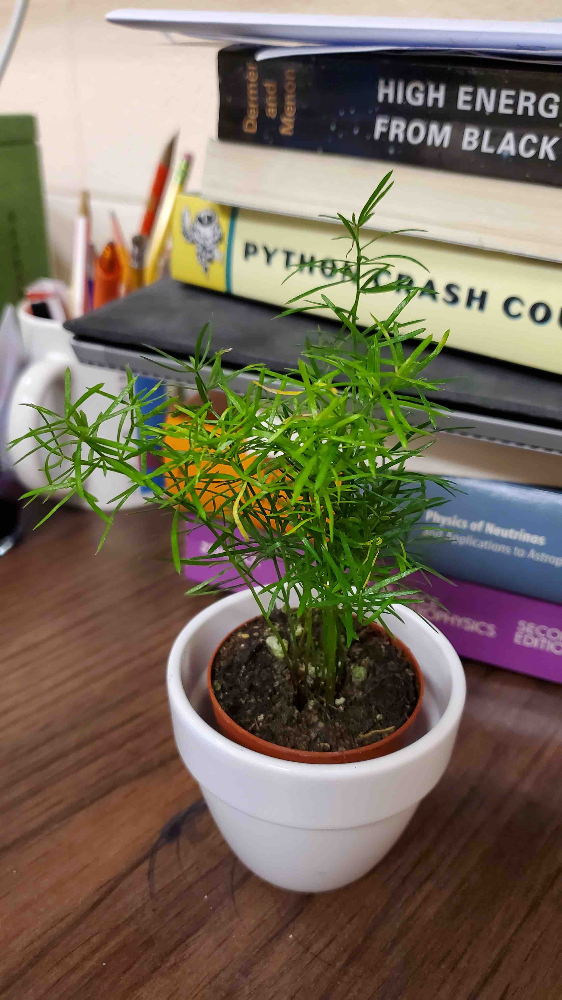
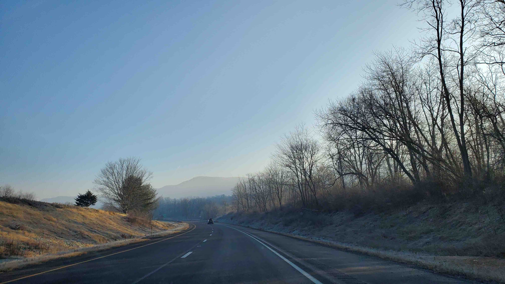

<h2>Gallery</h2>

"知识之必要，探索之必要，片刻宁静之必要，身心安顿之必要，凝视之必要，书写之必要"

“The necessity of knowledge, the necessity of exploration, the necessity of moments of tranquility, the necessity of settling the body and mind, the necessity of gazing, the necessity of writing.”

</ br>

</ br>

</ br>

