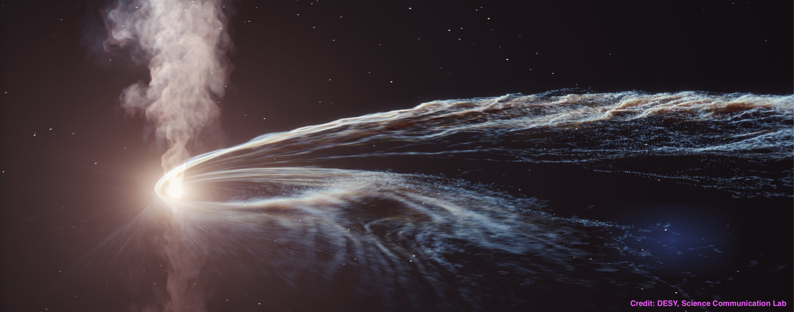
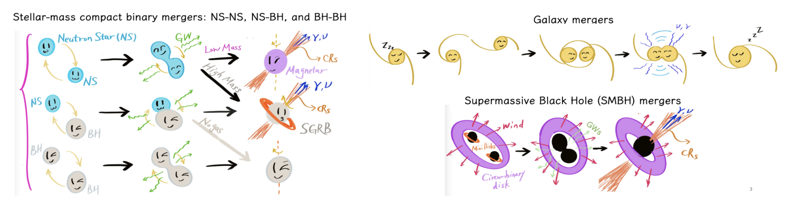

## Welcome!

I'm a postdoctoral scholar at the Deutsches Elektronen-Synchrotron DESY. I'm interested in multi-messenger astrophysics and astroparticle physics. 

I joined Dr. Walter Winter's group at DESY in October 2022. In August 2022, I obtained my PhD in Physics at Penn State University, where I was mentored by Dr. [Péter Mészáros](http://personal.psu.edu/nnp/) and Dr. [Kohta Murase](https://science.psu.edu/physics/people/kohta-murase). Before that, I received my B.Sc. degree in Astronomy from Nanjing University in China. 

My research focuses on the theoretical and numerical multi-messenger astrophysics, including the origins and implications of high-energy photons, cosmic rays, and neutrinos from individual cosmic sources and source populations. In particular, I model the acceleration, transport, and radiation processes of high-energy particles originating from tidal disruption events (TDEs), compact binary pairs (supermassive/stellar mass black holes), supernovae, gamma-ray bursts (GRBs), active galactic nuclei (AGNs), and galaxy/cluster mergers. I am interested in how the multi-messenger analyses enlighten our understanding of the physical nature of high-energy astrophysical phenomena.

### Links
* DESY: \[[DESY AP](https://astroparticle-physics.desy.de/about_us/group_members/theory/index_eng.html)\] \[[Confluence](https://confluence.desy.de)\] \[[GO DESY](https://go.desy.de)\]
* Penn State: \[[Physics](https://science.psu.edu/physics)\] \[[A&A](https://science.psu.edu/astro)\] \[[CMA](http://cpa.igc.psu.edu)\] \[[IGC](http://www.gravity.psu.edu)\]
* [ADS](https://ui.adsabs.harvard.edu) &#124; [arXiv-astro-ph.HE](https://arxiv.org/list/astro-ph.HE/recent) 
* Submit to [AAS Journals](https://aas.msubmit.net/) &#124; [Phys Rev Jorunals](https://authors.aps.org/Submissions/login/new) &#124; [MNRAS](https://mc.manuscriptcentral.com/mnras#)
<!--* [IceCube-pubs](https://icecube.wisc.edu/pubs) / [LIGO-detection-paper](https://www.ligo.caltech.edu/page/detection-companion-papers)  -->
* [NED](http://nedwww.ipac.caltech.edu) &#124; [Simbad](http://simbad.cfa.harvard.edu/simbad/)
* [Cosmological calculator](https://ned.ipac.caltech.edu/help/cosmology_calc.html) &#124; [PlotDigitizer](https://automeris.io/WebPlotDigitizer/) &#124; [HugeifyImage](https://waifu2x.booru.pics) &#124; [Higgstan](https://higgstan.com) &#124; 
* [AAS jobregister](https://jobregister.aas.org) &#124; [iNSPIRE.HEP](https://inspirehep.net) &#124; [Astroparticle conferences](http://www.nu.to.infn.it/conf/) &#124; [Astronomy meetings](http://www.cadc-ccda.hia-iha.nrc-cnrc.gc.ca/en/meetings/)
* [My Collections](https://yuan-cc.github.io/collections.html) &#124; [Color Palette](https://colors.dopely.top/palettes) &#124; [color-hex](https://www.color-hex.com)

<a href="https://yuan-cc.github.io/events.html" style="color:#B200B2;text-decoration: underline; font-weight: bold;">2023</a> &#124; [Previous years](https://yuan-cc.github.io/events.html)

(tbc)

**September 11 - September 15** 
TeVPA23, Napoli, Italy.

**July 18 - September 7** 
DESY summer undergraduate student program.

**June 25 - July 17** 
Summer vacation to U.S.

**April 25 - 27** 
Visit UCLouvain (Belgium) and give a seminar on April 26.

**February 27 - March 03** 
Astroparticle Workshop on Numerical Multimessenger Modeling, Ruhr-Universität Bochum (Germany)

**February 21/22** 
Postdoc representative, DESY Astroparticle Division meeting

**December 23, 2022 - January 2, 2023**  
Happy Holidays!

 

<!-- hitwebcounter Code START -->
       
 
   

