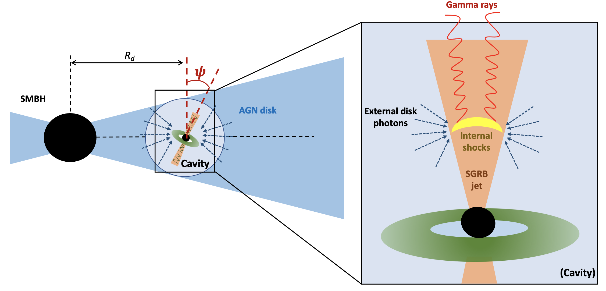
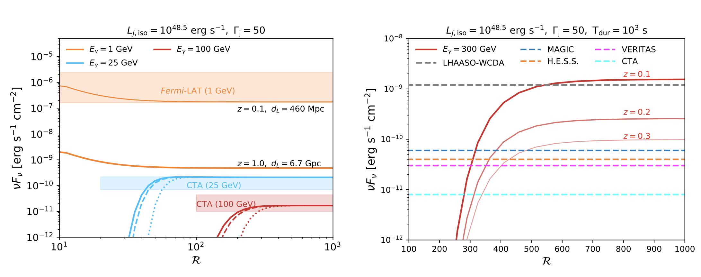

## Research project
<[back](https://yuan-cc.github.io/research/research.html)>

## GeV Signatures of Short GRBs in AGNs
* [arXiv: 2112.07653](https://arxiv.org/abs/2112.07653)

**Overview**

The joint detection of gravitational waves and the gamma-ray counterpart of a binary neutron star merger event, GW170817, unambiguously validates the connection between short gamma-ray bursts and compact binary object (CBO) mergers. We focus on a special scenario where short gamma-ray bursts produced by CBO mergers are embedded in disks of active galactic nuclei (AGN),
and we investigate the gamma-ray emission produced in the internal dissipation region via synchrotron, synchrotron self-Compton and external inverse-Compton (EIC) processes. In this scenario, isotropic thermal photons from the AGN disks contribute to the EIC component. We show that a low-density cavity can be formed in the migration traps, leading to the embedded mergers producing successful GRB jets. We find that the EIC component would dominate the GeV emission for typical CBO mergers with an isotropic-equivalent luminosity of $L_{j,\rm iso}=10^{48.5}~\rm erg~s^{-1}$ which are located close to the central supermassive black hole.
Considering a long-lasting jet of duration T=10^2-10^3 s, we find that Fermi-LAT can marginally resolve the GeV emission, subsequent to the GW detection by LIGO, if the nearby merger (redshift z<0.1) occurs extremely close to the SMBH. 
the future CTA will be able to detect its 25-100 GeV emission out to a redshift z=1.0. In the optimistic case, it is possible to detect the on-axis extended emission simultaneously with GWs within one decade using MAGIC, H.E.S.S., VERITAS, CTA, and LHAASO-WCDA. Early diagnosis of prompt emissions with Fermi-GBM and HAWC can provide valuable directional information for the follow-up observations.

