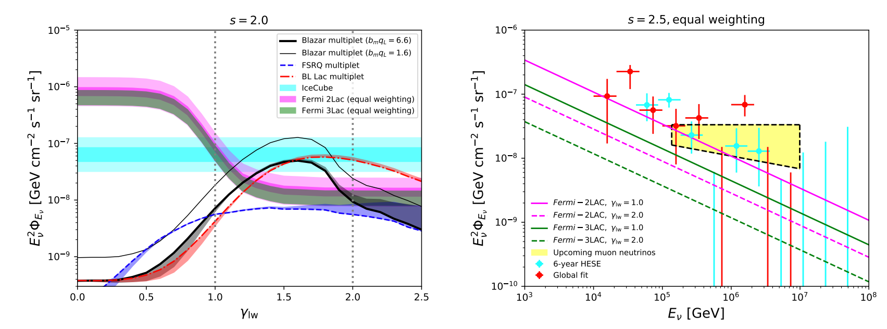

## Research project
<[previous](https://yuan-cc.github.io/research/projects/smbh_mergers.html) | [next](https://yuan-cc.github.io/research/projects/gal_mergers.html)>

### Complementarity of stacking and multiplet constraints on blazar neutrinos

The [full paper](https://iopscience.iop.org/article/10.3847/1538-4357/ab65ea)

**Overview**

We investigate the blazar contribution to the cumulative neutrino intensity assuming a generic
relationship between neutrino and gamma-ray luminosities, Lν ∝ (L_ph)^*&gamma;*. Using the gamma-ray
luminosity functions for blazars including flat spectrum radio quasars (FSRQs) and BL Lac objects,
as well as the Fermi-LAT detection efficiency, we estimate contributions from blazars resolved by
Fermi-LAT as well as the unresolved counterpart. The figure below shows the fraction of *Fermi*-LAT-resolved blazars in the
cumulative neutrino flux as a function of the index *&gamma;*. Combining this ratio with the existing limits of stacking analyses, we obtain the constraints on the blazar overall contributions (detected blazars + undetected blazars).

In addition, we present another type of constraints on the
origins of IceCube diffuse neutrinos, using the negative
results from the clustering test of neutrino-induced muon
track events. These high-energy track events are generally detected by IceCube with the angular resolution
∼ 0.5 deg, which enables us to determine the incoming
directions and perform clustering analysis on their time
and spatial distributions. So far, all the clustering tests
based on high-energy muon neutrinos have found no statistically significant evidence of clustering in the arrival
distribution of neutrinos. 

The bottom figure illustrates the upper limits for the all-blazar
neutrino flux from Fermi-LAT 2LAC and Fermi-LAT
3LAC analysis. We show all-flavor neutrino fluxes for all
curves and data points in this figure. The left panel shows the stacking constraints on the contributions
of all blazars to the cumulative neutrino flux and high-energy neutrino multiplet constraints on the blazar
contributions in the neutrino sky for an *&epsilon;^-2* neutrino spectrum. The magenta and green areas correspond to the all-blazar upper limit from
Fermi-LAT-2LAC and Fermi−3LAC equal weighting analysis, respectively. The cyan horizontal area shows the cumulative neutrino flux
detected by IceCube. The blue dashed, red dash-dotted and thick black lines illustrate the *m ≥ 2* multiplet constraints for FSRQs, BL
Lacs and all blazars whereas the corresponding areas show the uncertainties. The thin black line is the m ≥ 3 multiplet constraint for all
blazars. Right panel: the energy-dependent upper limits from the stacking analysis for the all-blazar contributions, assuming a neutrino
spectral index *s = 2.5*.

In conclusion, we
found that the multiplet constraints are the most important at lower values of *γ*, e.g. *γ ∼
< 1.0*, whereas
all-blazar constraints derived from the existing stacking
upper limits are more stringent for a stronger luminosity correlation, e.g., *γ ∼> 1.5*. The joint consideration
of these two kinds of limits supports the extended argument that all blazars, including Fermi−unresolved ones,
are unlikely to dominate the cumulative neutrino background for a generic correlation between the neutrino
and gamma-ray luminosities, *Lν ∝ (Lph)^γ* , with the index *0 ∼< γ ∼< 2.5*. 
