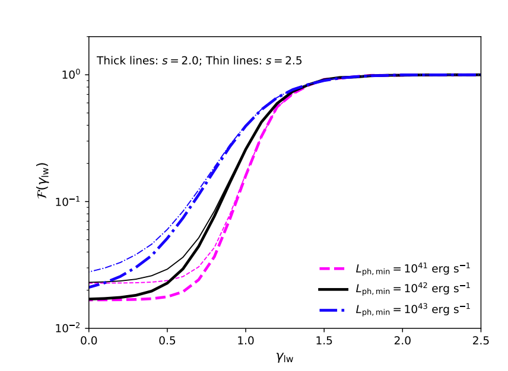

## Research project
<[previous](https://yuan-cc.github.io/research/projects/smbh_mergers.html) | [next](https://yuan-cc.github.io/research/projects/gal_mergers.html)>

### Complementarity of stacking and multiplet constraints on blazar neutrinos

The [full paper](https://iopscience.iop.org/article/10.3847/1538-4357/ab65ea)

**Overview**

We investigate the blazar contribution to the cumulative neutrino intensity assuming a generic
relationship between neutrino and gamma-ray luminosities, Lν ∝ (L_ph)^*&gamma;*. Using the gamma-ray
luminosity functions for blazars including flat spectrum radio quasars (FSRQs) and BL Lac objects,
as well as the Fermi-LAT detection efficiency, we estimate contributions from blazars resolved by
Fermi-LAT as well as the unresolved counterpart. The figure below shows the fraction of *Fermi*-LAT-resolved blazars in the
cumulative neutrino flux as a function of the index *&gamma;*. Combining this ratio with the existing limits of stacking analyses, we obtain the constraints on the blazar overall contributions (detected blazars + undetected blazars).

In addition, we present another type of constraints on the
origins of IceCube diffuse neutrinos, using the negative
results from the clustering test of neutrino-induced muon
track events. These high-energy track events are generally detected by IceCube with the angular resolution
∼ 0.5 deg, which enables us to determine the incoming
directions and perform clustering analysis on their time
and spatial distributions. So far, all the clustering tests
based on high-energy muon neutrinos have found no statistically significant evidence of clustering in the arrival
distribution of neutrinos. 
