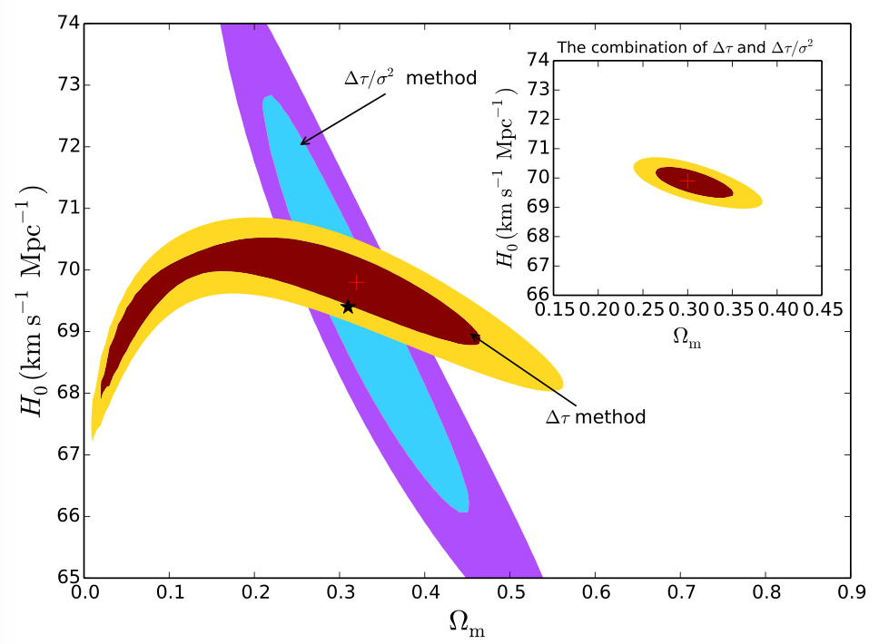

## Research project

### Cosmological test using strong gravitational lensing systems

The [full paper](https://academic.oup.com/mnras/article/452/3/2423/1080095)

**Overview**

(This was my first research project. When I was a second-year undergraduate student in NJU, I received this project from Prof. Fayin Wang and then I started to study the fundamental theories of cosmology as well as the relevant programming skills. I was so happy and excited to witness the publication of this paper after one year's hard work.)

One of the most intriguing predictions from Einstein's general relativity is that the light can be bent around a massive object. In the cosmological distances, strong gravitational lensing occurs when the bending effect is strong enough to produce mutiple images of the source. The temporal and geometric properties (e.g. the time delay and the velocity disperson of the lens galaxy) of the image encodes the information of the angular diameter distances between observer, lens and source. In this case, we can use such lensing systems a a probe of the universe and constrain the gravitational parameters that determines the cosmological distance.

In this work, instead of treating the time delay and velocity disperson as independent probes, we find that the combined quantity 
(time delay)/(velocity disperson)^2 is more sensitive for different cosmological models, as illustrated in the figure below, where *z_l* is the redshift of lens galaxy.

*Fig 1 from Yuan & Wang (2015): sensitivity of three methods in constraining the cosmological parameters in &Lambda;CDM universe.*

Moreover, we use Monte Carlo simulations to make one-on-one comparisons between &Lambda;CDM universe and Rh = ct universe. We find that our new probe can be more efficient for model selections. In particlar, less lensing systems are required to exclude another model with 3&sigma; significance if one model is assumed as the background. In addition, the joint consideration of our new probe and the time delay information will lead to a more stringent constraint on Hubble constant and &Omega;m simultaneously (See the right figure).

 
*Fig 6 from Yuan & Wang (2015): the 2&sigma; and 3&sigma; constraints for &Lambda;CDM model on the &Omega;m–H0 plane for both τ and τ/σ2 methods*
