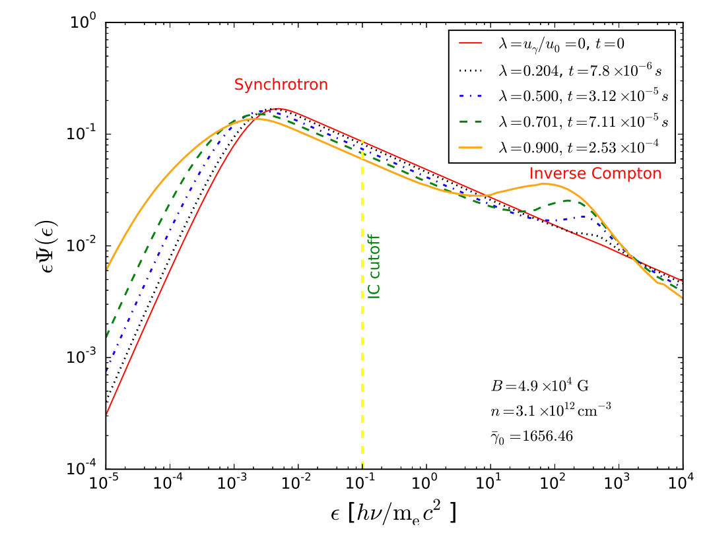
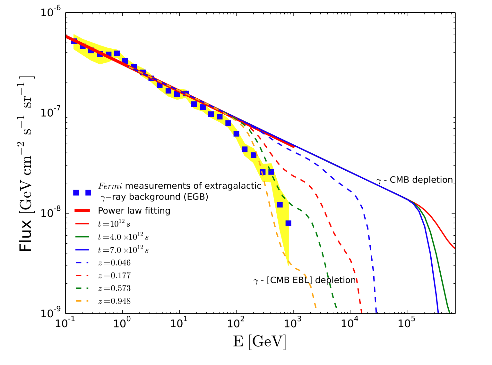

## Research project

### Monte Carlo Electron-Photon Interactions with Pair Formation

The [write-up](e_gamma_write_up.pdf)

**Overview**

(I completed this project during my visit to Penn State in Summer 2015.)

In this project, I wrote an adaptive Monte Carlo code in C++ to solve the time-dependent kinetic equations for relativistic electron in an isotropic
photon field. The processes such as synchrotron radiation, inverse Compton scattering, gamma-gamma pair production and pair annihilation are included. The code was then used in other projects.

The figure below shows one output of this code. In this example, initially the magnetic field in the simulated box is 490 micro Gauss and there is no photons. We inject ralativistic electrons with a power-law distribution to this region and solve the differential equations to obtain the evolution of the radiation spectrum. As time goes on, we find that the inverse Compton component (the right hump) becomes increasingly important and the kinitic energy of electrons is gradually transferred to the raidation field (as the parameter &lambda; increases to 1).

 
<em>Snapshots of the radiation spectra at various times.</em>

 
 
 
 
 
 
 
 
 
 
 

After developed this code, I applied it to calculate the cosmic gamma-gamma annihilations between the high-energy gamma rays and the photon backgrounds including the cosmoc microwave background (CMB) and infrared extragalactic background light (EBL). Our toy model is consistent with the gamma-ray background detected by <em>Fermi-</em>LAT.

   
<em>Cosmic attenuations of high-energy gamma rays.</em>

