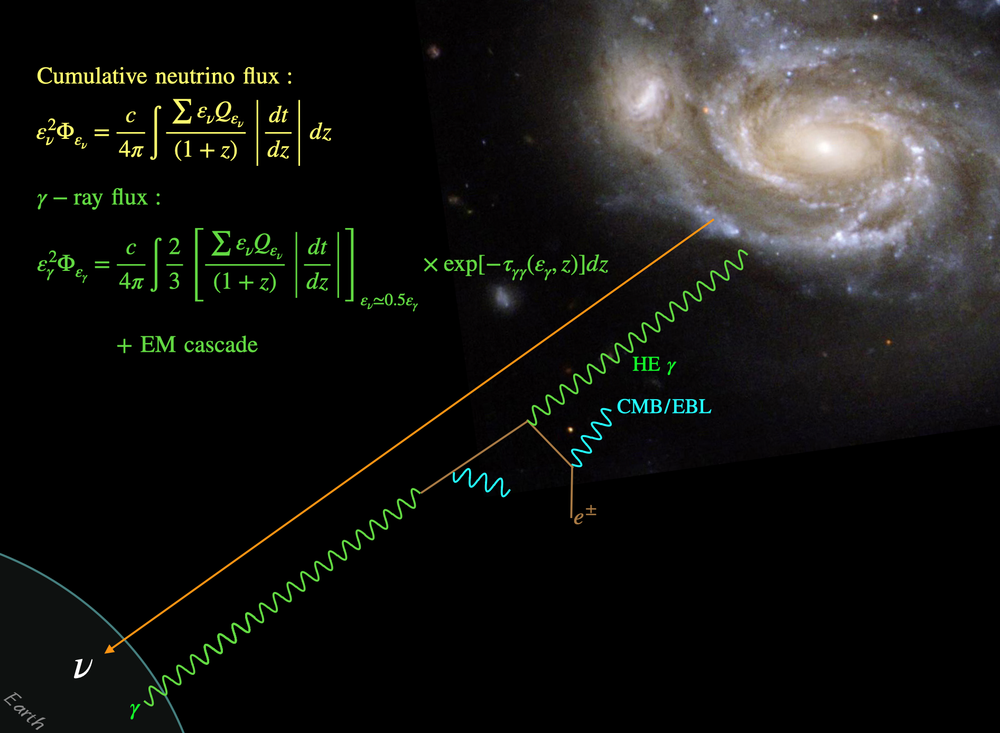
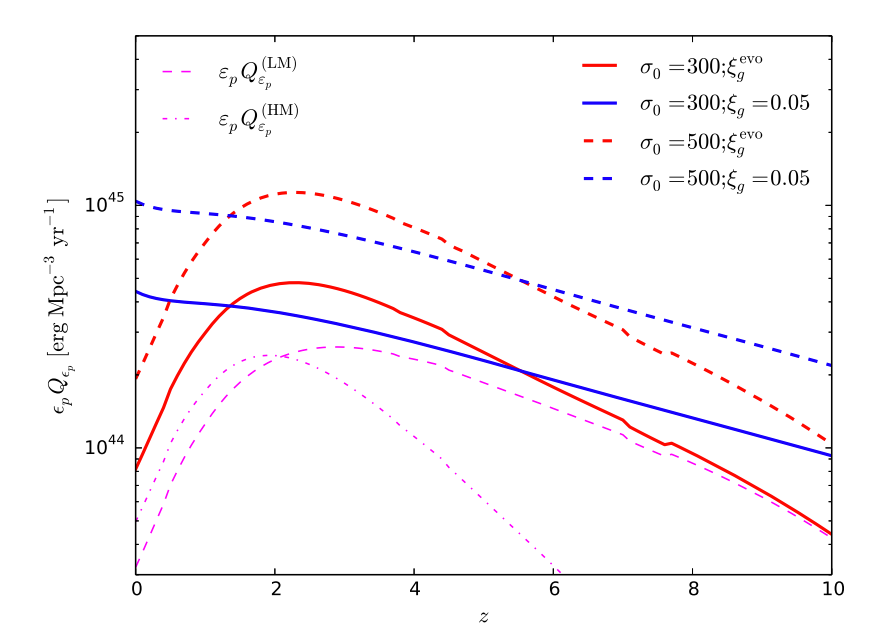
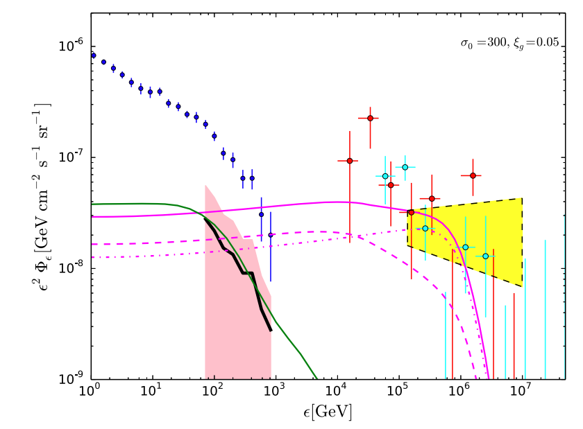
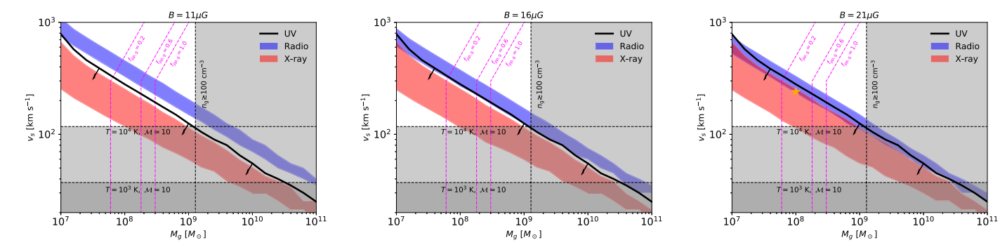
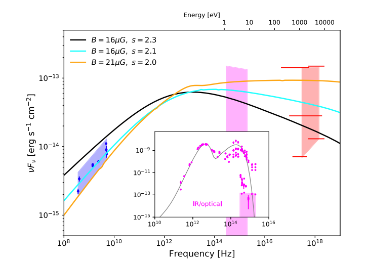

## Research project
<[previous](https://yuan-cc.github.io/research/projects/complementarity.html)  [next](https://yuan-cc.github.io/research/projects/e_gamma_interactions.html)>

### A multimessenger picture of galaxy and halo mergers

For details:
* [Neutrino paper](https://iopscience.iop.org/article/10.3847/1538-4357/aab774)
* [EM counterpart paper](https://iopscience.iop.org/article/10.3847/1538-4357/ab1f06)
* Stochastic GW results in [[pdf]](gal_mergers_gw.pdf)

**Overview**

The motivation of this project is that the merger of dark matter halos and the gaseous structures embedded in them, such as protogalaxies, galaxies, and groups and clusters of galaxies, results in strong shocks that are capable of accelerating cosmic rays (CRs) to ~ 10 PeV. These shocks will produce high-energy neutrinos and gamma-rays through inelastic *pp* collisions. In the first part this work, we study the contributions of these halo mergers to the diffuse neutrino flux and to the nonblazar portion of the extragalactic gamma-ray background. We formulate the redshift dependence of the shock velocity, galactic radius,
halo gas content, and galactic/intergalactic magnetic fields over the dark matter halo distribution up to a redshift
*z = 10*. The schematic figure shows the propagation and interactions of cosmogenic CRs.

 

We find that high-redshift mergers contribute a significant amount of the CR luminosity density, and the
resulting neutrino spectra could explain a large part of the observed diffuse neutrino flux above 0.1 PeV up to
several PeV. We also show that our model can somewhat alleviate tensions with the extragalactic gamma-ray
background. The main reason is that a larger fraction of the CR luminosity density comes from high redshifts. In this case the accompanying γ-rays are more strongly suppressed through γγ annihilations with the cosmic microwave background and the extragalactic background light. The left and right panels below respectively show the redshift evolution of CR intensities and the cumulative neutrino/gamma-ray spectra.

 
 
 
*Fig 3 (left) and Fig. 5 (right) from Yuan et al. (2017)*
 
 
On the other hand, the secondary electron-positron pairs produced from *pp* collision will radiate observable emissions through
synchrotron radiation and inverse Compton scattering while propagating in the galactic magnetic field. In the second part of this project, we calculated the EM emissions from the secondary particles and use this model to explain the observed radio and X-ray data points. We selected two merging galaxies NGC 660 and NGC 3256. The figures below show the constraints on the gas mass and the shock velocity for NGC 660 as well as the fitting to the spectral energy distribution.

 
 
 
 
 
 
 
 
 
 
 

 

 
 

 
 

 
 
 
 

Since the galaxy mergers typically lead to the merger of SMBHs, we expect the stochastic GW emission from galaxy mergers may be detected by the next generation GW detector, LISA. We estimated the stochastic GW power spectra for different mass scenarios:
* 1E6-1E6: all SMBHs are identical and the mass is 10^6 solar mass.
* EM: a mass distribution of SMBHs are used, however the mass ratio is fix to be 1:1.
* DM: a mass distribution of SMBHs are used and the masses of the two black holes are independent.

The spectral intensity for these scenarios are shown below

