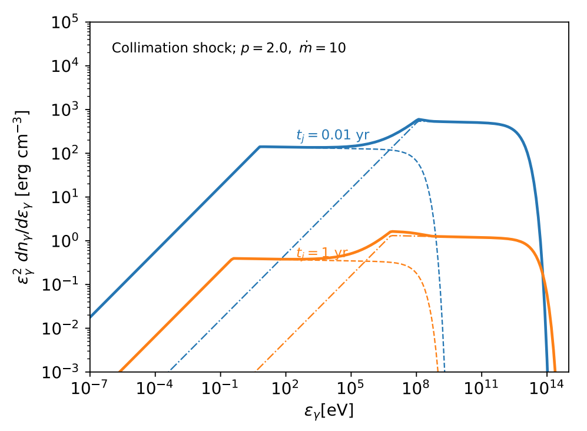
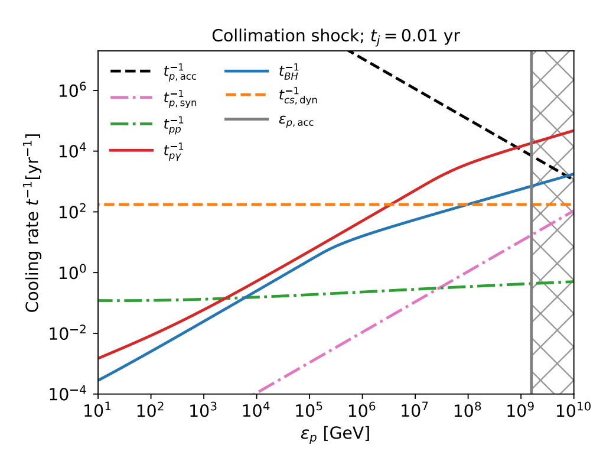
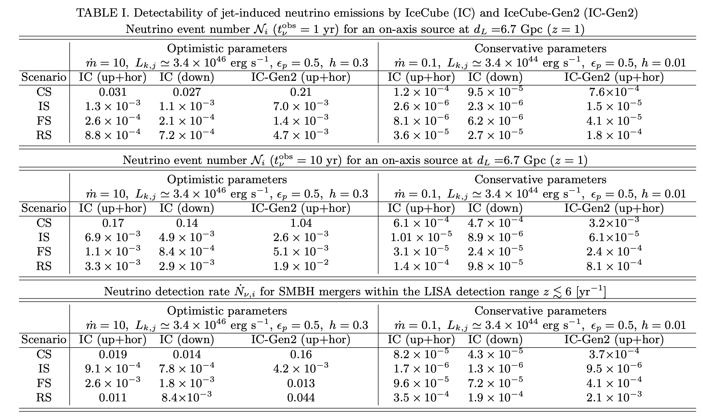
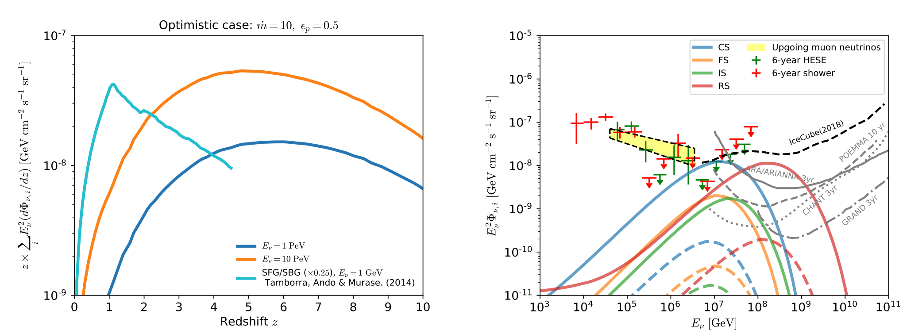

## Research project
<[next](https://yuan-cc.github.io/research/projects/complementarity.html)>

### High-energy neutrino emission subsequent to gravitational wave radiation from supermassive black hole mergers
* The [neutrino paper](https://arxiv.org/abs/2008.05616)
* The EM counterpart paper: preparing 

**Overview**

Supermassive black hole (SMBH) coalescences are ubiquitous in the history of the Universe and
often exhibit strong accretion activities and powerful jets. These SMBH mergers are also promising candidates for future gravitational wave detectors such as Laser Space Inteferometric Antenna (LISA). In this work, we consider neutrino counterpart emission originating from the jet-induced
shocks. The physical picture is that relativistic jets launched after the merger will push forward
inside the premerger disk wind material, and then they subsequently get collimated, leading to the
formation of internal shocks, collimation shocks, forward shocks and reverse shocks. Cosmic rays can
be accelerated in these sites and neutrinos are expected via the photomeson production process. We
formulate the jet structures and relevant interactions therein, and then evaluate neutrino emission
from each shock site. The schematic picture below shows the structure of the jet-cocoon system.

In astrophysical environments, neutrinos are produced through the decay of pions created by CRs via pp and/or pγ interactions. 

Since the collimated jet is optically thin, we focus on nonthermal photons produced by the accelerated electrons and treat each site as an independent neutrino emitter, where the subtle interactions between particles from different regions are not considered. Here, we take a semianalytical approach to model the synchrotron and synchrotron-self-Compton (SSC) components of the target photon fields (see the right figure). 

To calculate the neutrino emission, we need to estimate the cooling and acceleration timescales of the protons. 

Here we consider the CS case as an example, and it is straightforward to rewrite the relevant equations to cover the IS, FS and RS scenarios. The right figure depicts the timescales/cooling rates of particle interactions at CS. 

Assuming that the high-energy protons have the canonical shock acceleration spectrum with a spectral index *p = 2* and an exponential cutoff at the maximum proton energy, we obtain the single flavor isotropic neutrino spectrum at each site in the observer’s frame. From the lightcurves of neutrino emission, we can calculate the integrated neutrino fluence at a give observation duration and further estimate the detection rates for IceCube and IceCube Gen-2. The table below presents the expected 1-year and 10-year event numbers.

From this table we find that month-to-year high-energy neutrino emission from the post-merger jet after the gravitational wave event is detectable by IceCube-Gen2 within approximately five to ten years of operation in optimistic cases where the cosmic-ray loading is sufficiently high and a mildly super-Eddington accretion is achieved. Meanwhile, we calculated the neutrino detection rates within the LISA detection range. We find that it may be challenging for IceCube-Gen2 to detect neutrinos from LISA-detected SMBH mergers
with conservative parameters. On the other
hand, if the LISA-detected binary SMBH systems are
super-Eddington accreters before and af-
ter the merger, the resulting neutrino emission from the
jet-induced shocks may be detected by IceCube-Gen2
within a decade.

We also evaluated the contribution of SMBH mergers to the diffuse neutrino background. 

The left panel shows the differential neutrino intensities as a function of redshift, in comparison with the SFG case, whereas the right figure illustrates the redshift-integrated all-flavor diffuse neutrino flux expected from relativistic jets in SMBH mergers. Our results demonstrate that 
a significant fraction of the observed very high-energy (*Eν > 1 PeV*) IceCube neutrinos could originate from them in the optimistic cases. Since SMBH mergers are promising emitters of ultrahigh-energy neutrinos, these sources will become important candidates for future neutrino detectors and in this case our model can be tested and constrained. 

