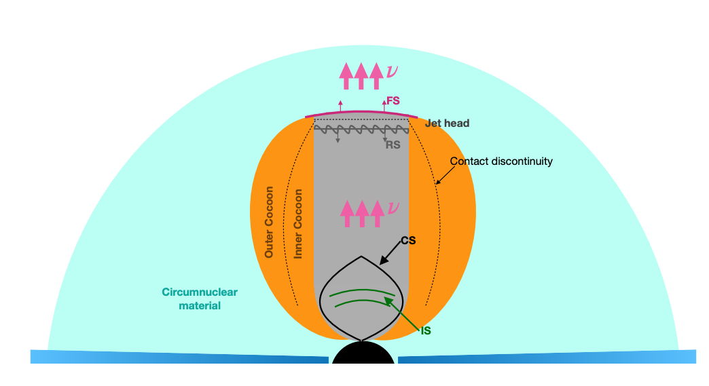

## Research project
<[next](https://yuan-cc.github.io/research/projects/complementarity.html)>

### High-energy neutrino emission subsequent to gravitational wave radiation from supermassive black hole mergers
* The [neutrino paper](https://arxiv.org/abs/2008.05616)
* The EM counterpart paper: preparing 

**Overview**

Supermassive black hole (SMBH) coalescences are ubiquitous in the history of the Universe and
often exhibit strong accretion activities and powerful jets. These SMBH mergers are also promising candidates for future gravitational wave detectors such as Laser Space Inteferometric Antenna (LISA). In this work, we consider neutrino counterpart emission originating from the jet-induced
shocks. The physical picture is that relativistic jets launched after the merger will push forward
inside the premerger disk wind material, and then they subsequently get collimated, leading to the
formation of internal shocks, collimation shocks, forward shocks and reverse shocks. Cosmic rays can
be accelerated in these sites and neutrinos are expected via the photomeson production process. We
formulate the jet structures and relevant interactions therein, and then evaluate neutrino emission
from each shock site. The schematic picture below shows the structure of the jet-cocoon system.

In astrophysical environments, neutrinos are produced through the decay of pions created by CRs via pp and/or pγ interactions. 

Since the collimated jet is optically thin, we focus on nonthermal photons produced by the accelerated electrons and treat each site as an independent neutrino emitter, where the subtle interactions between particles from different regions are not considered. Here, we take a semianalytical approach to model the synchrotron and synchrotron-self-Compton (SSC) components of the target photon fields (see the right figure). 

To calculate the neutrino emission, we need to esti- mate the cooling and acceleration timescales of the pro- tons. Here we consider the CS case as an example, and it is straightforward to rewrite the relevant equations to cover the IS, FS and RS scenarios. The right figure depicts the timescales/cooling rates of particle interactions at CS.

