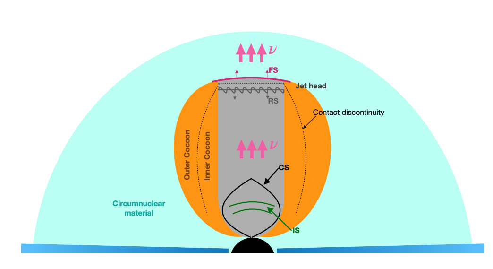

<body>

<h2>Round Card</h2>

 <a href="https://yuan-cc.github.io/research/projects/smbh_mergers.html">
  
  

    
Neutrino and EM emissions from SMBH mergers

  
 </a>

 
  
  

    <a href="https://yuan-cc.github.io/research/projects/smbh_mergers.html">
Neutrino and EM emissions from SMBH mergers
 </a>
  

  

</body>

### Projects
[Slides](https://yuan-cc.github.io/research/files/slides.pdf)

* Gamma-ray emission from short GRBs embedded in AGN disks (paper in preparation)
* [High-energy neutrino and EM emissions subsequent to GW radiation from SMBH mergers](https://yuan-cc.github.io/research/projects/smbh_mergers.html)
* [Complementarity of stacking and multiplet constraints on blazar neutrinos](https://yuan-cc.github.io/research/projects/complementarity.html)
* [A multimessenger picture of galaxy and halo mergers](https://yuan-cc.github.io/research/projects/gal_mergers.html)
* [Monte Carlo Electron-Photon Interactions with Pair Formation](https://yuan-cc.github.io/research/projects/e_gamma_interactions.html)
* [Cosmological test using strong gravitational lensing systems](https://yuan-cc.github.io/research/projects/cosmological_test.html)

<!-- ### Notes
* [Differential geometry (in Chinese)](https://yuan-cc.github.io/research/files/differential_geometry.pdf) / [Tensor calculus](https://yuan-cc.github.io/research/files/tensors.pdf) / [Group theory](https://yuan-cc.github.io/research/files/group_theory.pdf) -->
