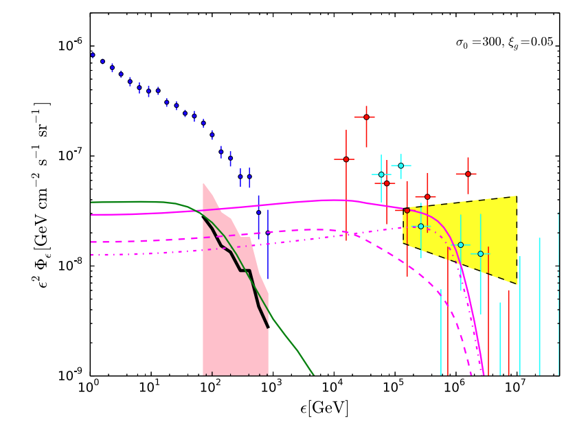

<body>

<h2>Research projects</h2>
 [<a href="https://yuan-cc.github.io/research/files/slides.pdf">Slides</a>]

 <a href="https://yuan-cc.github.io/research/projects/smbh_mergers.html">
  
  

   
 
Gamma-ray emission from short GRBs embedded in AGN disks

  
 </a>

 <a href="https://yuan-cc.github.io/research/projects/smbh_mergers.html">
  
  

   
 
Neutrino and EM emissions from SMBH mergers

  
 </a>

 

  
  

 <a href="https://yuan-cc.github.io/research/projects/gal_mergers.html">
  
  

   
 
A multimessenger picture of galaxy and halo mergers

  
 </a>

 <a href="https://yuan-cc.github.io/research/projects/complementarity.html">
  
  

   
 
Stacking and multiplet constraints on blazar neutrinos

  
 </a>

 

  

 <a href="https://yuan-cc.github.io/research/projects/e_gamma_interactions.html">
  
  

   
 
Monte Carlo Electron-Photon Interactions with Pair Formation

  
 </a>

 <a href="https://yuan-cc.github.io/research/projects/cosmological_test.html">
  
  

   
 
Cosmological test using strong gravitational lensing systems

  
 </a>

 

  
</body>

